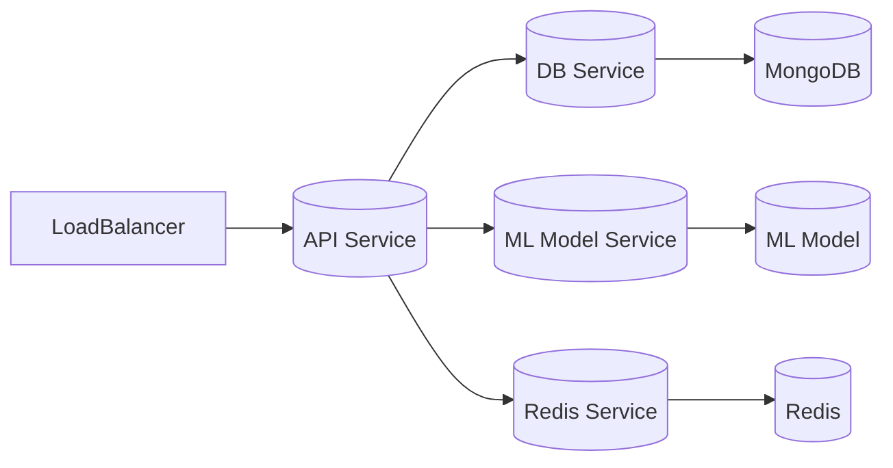
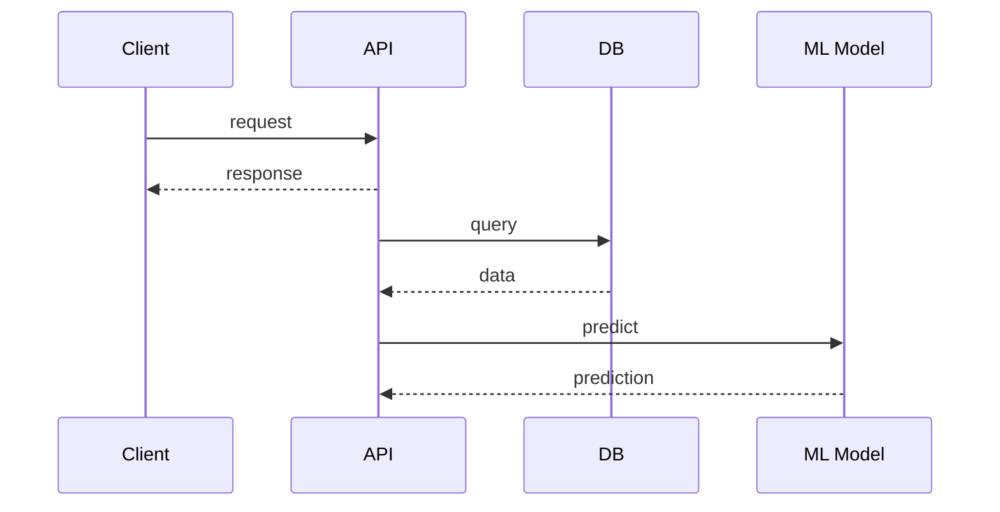

# Architecture
## Introduction
The auto-debug-ts project is designed to automatically identify and fix common errors in TypeScript code. This document outlines the architecture of the system, including the technology stack, component breakdown, data flow, and design patterns used.

## System Overview
The auto-debug-ts system operates at the application level, interacting with clients, databases, and machine learning models. The C4 context diagram below illustrates the system's context:
```mermaid
graph LR
  Client[(Client)] -->|requests|> auto-debug-ts[auto-debug-ts]
  auto-debug-ts -->|data retrieval|> MongoDB[(MongoDB)]
  auto-debug-ts -->|predictions|> Redis[(Redis)]
  auto-debug-ts -->|predictions|> ML_Model[(ML Model)]
```
The system is composed of the following components:

* Client: The client is the user-facing application that interacts with the auto-debug-ts system.
* auto-debug-ts: The auto-debug-ts system is the core application that processes requests and interacts with the databases and machine learning models.
* MongoDB: The MongoDB database stores the data used by the auto-debug-ts system.
* Redis: The Redis database is used for caching and storing temporary data.
* ML Model: The machine learning model is used to make predictions and provide insights to the auto-debug-ts system.

## Container Architecture
The auto-debug-ts system is containerized using Docker, allowing for easy deployment and scalability. The system consists of the following services:

* API: The API service handles incoming requests from clients and interacts with the databases and machine learning models.
* DB: The DB service manages the MongoDB database and provides data to the API service.
* ML Model: The ML Model service manages the machine learning model and provides predictions to the API service.
* Redis: The Redis service manages the Redis database and provides caching and temporary storage to the API service.

The following diagram illustrates the container architecture:

## Component Breakdown
The auto-debug-ts system consists of the following key components:

* **API Controller**: Handles incoming requests from clients and interacts with the databases and machine learning models.
* **DB Manager**: Manages the MongoDB database and provides data to the API controller.
* **ML Model Manager**: Manages the machine learning model and provides predictions to the API controller.
* **Redis Manager**: Manages the Redis database and provides caching and temporary storage to the API controller.
* **Error Handler**: Handles errors and provides feedback to clients.
* **Logger**: Logs system events and errors.

## Data Flow
The data flow through the system is as follows:

1. Client sends a request to the API service.
2. API service interacts with the DB service to retrieve data.
3. DB service retrieves data from the MongoDB database.
4. API service interacts with the ML Model service to make predictions.
5. ML Model service uses the machine learning model to make predictions.
6. API service receives predictions from the ML Model service.
7. API service returns a response to the client.
8. Client receives the response and provides feedback to the user.

The following sequence diagram illustrates the data flow:

## Design Patterns Used
The auto-debug-ts system uses the following design patterns:

* **Microservices Architecture**: The system is composed of multiple services that interact with each other to provide a cohesive system.
* **Repository Pattern**: The DB manager uses the repository pattern to abstract the data storage and retrieval.
* **Factory Pattern**: The ML Model manager uses the factory pattern to create instances of the machine learning model.
* **Observer Pattern**: The API controller uses the observer pattern to notify the error handler and logger of system events.

The rationale for using these design patterns is to provide a scalable, maintainable, and flexible system that can easily be extended to meet changing requirements.

## Scalability Considerations
The auto-debug-ts system is designed to scale horizontally, with each service able to be scaled independently. The system uses the following strategies to achieve scalability:

* **Load Balancing**: The system uses a load balancer to distribute incoming requests across multiple instances of the API service.
* **Caching**: The system uses Redis to cache frequently accessed data, reducing the load on the database and improving response times.
* **Queuing**: The system uses a message queue to handle async requests and improve system responsiveness.

## Security Model
The auto-debug-ts system uses the following security measures to protect user data:

* **Authentication**: The system uses authentication to verify the identity of clients and ensure that only authorized users can access the system.
* **Data Encryption**: The system uses encryption to protect user data both in transit and at rest.
* **Input Validation**: The system uses input validation to ensure that user input is valid and does not pose a security risk.

## Technology Rationale
The auto-debug-ts system uses the following technologies:

* **TypeScript**: The system uses TypeScript as the programming language due to its strong typing and object-oriented features.
* **Express**: The system uses Express as the web framework due to its lightweight and flexible architecture.
* **MongoDB**: The system uses MongoDB as the database due to its document-oriented data model and high performance.
* **Redis**: The system uses Redis as the caching layer due to its high performance and ease of use.
* **Docker**: The system uses Docker as the containerization platform due to its ease of use and high performance.

The rationale for using these technologies is to provide a fast, scalable, and maintainable system that can easily be extended to meet changing requirements.

## Deployment Architecture
The auto-debug-ts system is deployed using the following architecture:
```mermaid
graph LR
  Internet --> LoadBalancer
  LoadBalancer --> AppServer
  AppServer --> DB
  DB --> ML Model
```
The system is deployed on a cloud platform, with the load balancer and app server instances scaled horizontally to meet changing demand.

## Future Architecture Evolution
The auto-debug-ts system is expected to evolve over time to meet changing requirements and new use cases. The following are potential future architecture changes:

* **Addition of new machine learning models**: The system may be extended to include new machine learning models that provide additional insights and predictions.
* **Integration with new data sources**: The system may be extended to integrate with new data sources, such as APIs or file systems.
* **Addition of new services**: The system may be extended to include new services that provide additional functionality, such as user management or notification services.
* **Use of new technologies**: The system may be extended to use new technologies, such as serverless computing or graph databases.

The auto-debug-ts system is designed to be flexible and adaptable, with a modular architecture that allows for easy extension and modification.